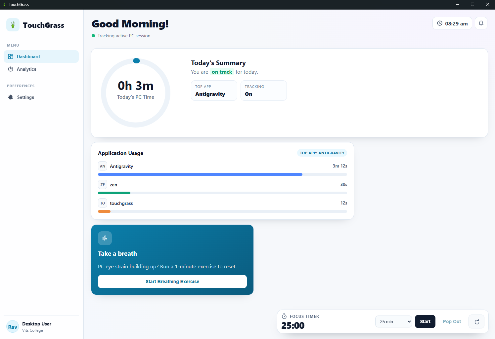
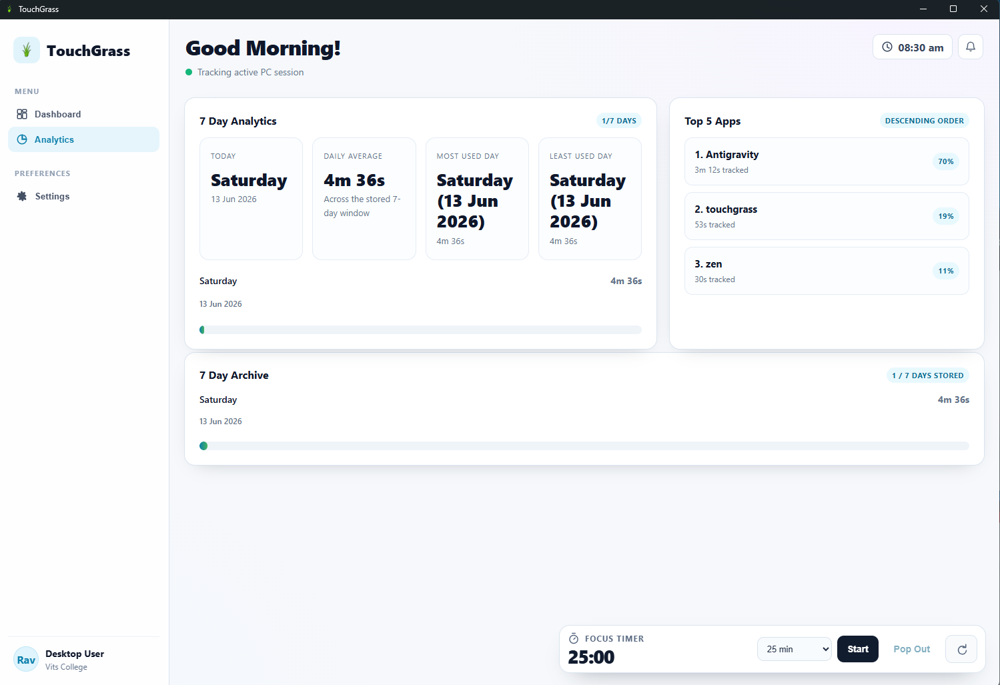
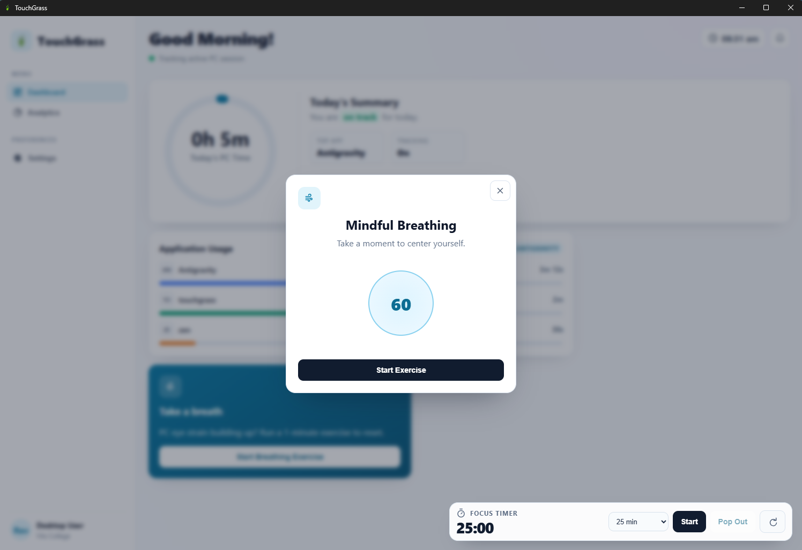
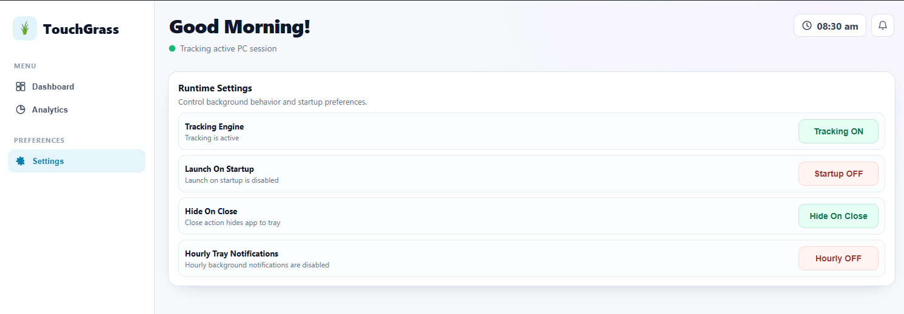

# 🌿 TouchGrass — Marketing Website

The official marketing and download site for [TouchGrass](https://github.com/Pranayy1/TouchGrass), a free, open-source Windows desktop app that tracks screen time, blocks distractions, and helps you build healthier digital habits. This repository contains the static website hosted at **[pranayy1.github.io/touchgrass-site](https://pranayy1.github.io/touchgrass-site/)**.

Built with zero dependencies — just semantic HTML, vanilla CSS, and vanilla JavaScript.

---

## ✨ Features

- **Homepage** — Hero section, feature cards, screenshot gallery with lightbox, how-it-works steps, download CTA, and feedback/bug-report links
- **Download Page** — Side-by-side installer cards (.EXE and .MSI) with 3D tilt micro-interaction, pulsing recommended badge, and help section
- **Fully Responsive** — Mobile-first breakpoints at 1024px, 768px, 480px, and 360px with hamburger nav, horizontal scroll carousels, and stacked layouts
- **Scroll Reveal Animations** — Intersection Observer-powered fade-up animations with staggered delays
- **Lightbox Gallery** — Full-screen screenshot viewer with keyboard navigation (← → Esc), prev/next buttons, and backdrop blur
- **Frosted Glass Header** — Fixed navigation with scroll-triggered glassmorphism effect
- **SEO Optimized** — Open Graph, Twitter Cards, JSON-LD structured data, sitemap, robots.txt, canonical URLs, and semantic HTML
- **Accessibility** — ARIA labels, keyboard navigation, `prefers-reduced-motion` support, touch device optimizations, screen reader-friendly markup
- **Performance** — Critical CSS inlined, async font loading with preconnect, lazy-loaded images, zero external JS dependencies

---

## 🛠️ Tech Stack

| Layer | Technology |
|-------|------------|
| **Markup** | Semantic HTML5 |
| **Styling** | Vanilla CSS with CSS Custom Properties (no framework) |
| **JavaScript** | Vanilla JS (ES5-compatible, IIFE pattern, zero dependencies) |
| **Fonts** | [Inter](https://fonts.google.com/specimen/Inter) + [JetBrains Mono](https://fonts.google.com/specimen/JetBrains+Mono) via Google Fonts |
| **Icons** | Inline SVG (hand-crafted, no icon library) |
| **Hosting** | GitHub Pages |
| **App Framework** | The desktop app itself uses [Tauri](https://tauri.app/) + Rust (this repo is the _website_ only) |

---

## 📁 Project Structure

```
touchgrass-site/
├── index.html                          # Homepage (hero, features, screenshots, download CTA, feedback)
├── download.html                       # Download page (EXE & MSI installer cards)
├── robots.txt                          # Crawler directives
├── sitemap.xml                         # Sitemap for search engines
├── touchgrass_site_prd.md              # Product Requirements Document
├── README.md                           # This file
│
├── styles/
│   ├── main.css                        # Global design system + homepage styles (~1046 lines)
│   └── download.css                    # Download page-specific styles (~703 lines)
│
├── scripts/
│   ├── main.js                         # Global interactions: nav toggle, scroll reveal, lightbox (~175 lines)
│   └── download.js                     # Download page: click tracking, 3D card tilt (~59 lines)
│
└── assets/
    ├── icon.png                        # App icon / favicon
    ├── apple-touch-icon.png            # Apple touch icon
    ├── hero-illustration.png           # Hero section illustration
    ├── og-image.png                    # Open Graph social sharing image (1200×630)
    ├── screenshot/                     # 6 app screenshots for the gallery
    │   ├── homepage.png
    │   ├── analytics-page.png
    │   ├── breathing_excersice.png
    │   ├── draggable_timer_popout.png
    │   ├── timer_before_popout.png
    │   └── setting-page.png
    ├── setups/                         # Desktop app installers
    │   ├── nsis/                       # .EXE installer (NSIS)
    │   └── msi/                        # .MSI package (Windows Installer)
    └── palette/                        # Color palette reference assets
```

---

## 🚀 Installation

This is a **static site** with no build step and no package manager. Clone the repository and you're ready to go:

```bash
git clone https://github.com/Pranayy1/touchgrass-site.git
cd touchgrass-site
```

---

## 💻 Development Setup

### Option 1: VS Code Live Server (Recommended)

1. Install the [Live Server](https://marketplace.visualstudio.com/items?itemName=ritwickdey.LiveServer) extension in VS Code
2. Open the project folder in VS Code
3. Right-click `index.html` → **Open with Live Server**
4. The site opens at `http://127.0.0.1:5500`

### Option 2: Python HTTP Server

```bash
# Python 3
python -m http.server 8000

# Then open http://localhost:8000
```

### Option 3: Node.js HTTP Server

```bash
npx -y serve .

# Then open the URL shown in terminal (typically http://localhost:3000)
```

> **Note:** A local server is recommended over opening `index.html` directly as a file, because relative asset paths and font loading work more reliably over HTTP.

---

## 🔧 Build Commands

This project has **no build step**. There is no `package.json`, no bundler, and no transpilation — the source files _are_ the production files.

| Task | Command |
|------|---------|
| **Serve locally** | Use any static server (see Development Setup above) |
| **Deploy** | Push to `main` branch → GitHub Pages auto-deploys |
| **Lint HTML** | `npx -y htmlhint index.html download.html` _(optional)_ |
| **Lint CSS** | `npx -y stylelint "styles/**/*.css"` _(optional)_ |

---

## ▶️ Running the Application

The site is automatically deployed via **GitHub Pages** on every push to the `main` branch:

🔗 **Live URL:** [https://pranayy1.github.io/touchgrass-site/](https://pranayy1.github.io/touchgrass-site/)

To run locally, start any static file server in the project root and open `index.html` in your browser (see [Development Setup](#-development-setup)).

---

## 📸 Screenshots

| Homepage | Download Page |
|----------|--------------|
|  |  |

| Breathing Exercise | Settings |
|-------------------|----------|
|  |  |

---

## 📄 Documentation

For complete product requirements, architecture, feature planning, and implementation details, see:

- [Project Requirements Document](touchgrass_site_prd.md)

---

## 🗺️ Roadmap

- [ ] Add a custom 404 error page
- [ ] Integrate download analytics (replace console logging)
- [ ] Add dark mode toggle
- [ ] Add changelog / release notes page
- [ ] Performance audit with Lighthouse CI
- [ ] Add `<noscript>` fallback for CSS preload on the download page

---

## 🤝 Contributing

Contributions are welcome! Here's how to get started:

1. **Fork** this repository
2. **Clone** your fork locally
3. **Create a branch** for your feature or fix:
   ```bash
   git checkout -b feature/your-feature-name
   ```
4. **Make your changes** and test locally with a static server
5. **Commit** with a descriptive message:
   ```bash
   git commit -m "Add: brief description of change"
   ```
6. **Push** and open a **Pull Request**

### Reporting Issues

- 🐛 [Report a Bug](https://github.com/Pranayy1/TouchGrass/issues/new?template=bug_report.md)
- 💡 [Request a Feature](https://github.com/Pranayy1/TouchGrass/issues/new?template=feature_request.md)
- ✉️ Email: [pranaypandey.dev@gmail.com](mailto:pranaypandey.dev@gmail.com)

---

## 📝 License

<!-- TODO: Add license type once a LICENSE file is added to the repository -->

This project is open source. See the main app repository for license details:
[TouchGrass on GitHub](https://github.com/Pranayy1/TouchGrass)

---

## 👤 Author

**Pranay Pandey**

- GitHub: [@Pranayy1](https://github.com/Pranayy1)
- Email: [pranaypandey.dev@gmail.com](mailto:pranaypandey.dev@gmail.com)
- App Repository: [Pranayy1/TouchGrass](https://github.com/Pranayy1/TouchGrass)

---

<p align="center">
  Made with 💚 using Tauri + Rust · Free & Open Source
</p>
