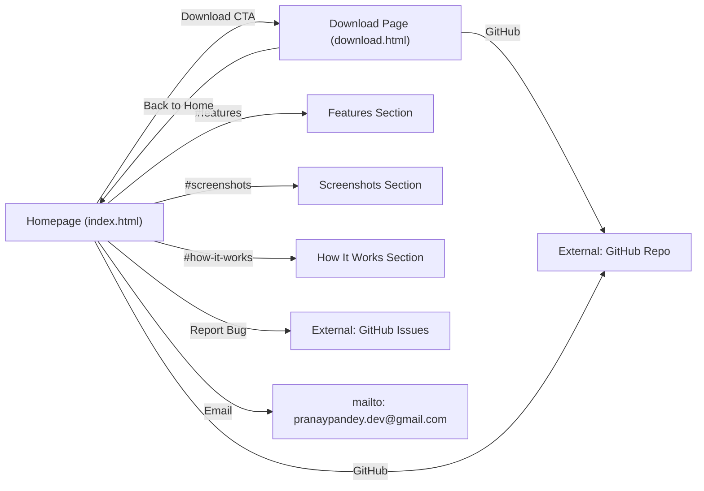

# TouchGrass Website — Product Requirements Document (PRD)

> **Product:** TouchGrass Marketing Website  
> **Domain:** [https://pranayy1.github.io/touchgrass-site/](https://pranayy1.github.io/touchgrass-site/)  
> **Repository:** [Pranayy1/touchgrass-site](https://github.com/Pranayy1/touchgrass-site)  
> **Last Updated:** 2026-06-25  

---

## 1. Product Overview

TouchGrass is a **free, open-source Windows desktop app** (built with Tauri + Rust) that helps users manage screen time and build healthier digital habits. The **website** is a static marketing/landing site that promotes the app, showcases its features, and provides download links.

### 1.1 Core Value Proposition
- Track app usage automatically on Windows
- Focus with a Pomodoro-style timer (docked or floating)
- Relax with guided breathing exercises
- Ambient soundscapes (rain, forest, lo-fi) built in
- 100% free, ~4 MB install, no accounts or subscriptions

---

## 2. Site Architecture

The website consists of **2 pages**:

| Page | File | URL | Purpose |
|------|------|-----|---------|
| **Homepage** | `index.html` | `/` | Landing page — hero, features, screenshots, how-it-works, download CTA, feedback |
| **Download** | `download.html` | `/download.html` | Dedicated download page with EXE and MSI installer options |

### 2.1 Navigation Flow



---

## 3. Page-by-Page Specification

### 3.1 Homepage (`index.html`)

The homepage is a single-page layout with **7 distinct sections**, all within a single scrollable view.

#### 3.1.1 Header / Navigation (`#site-header`)

| Property | Value |
|----------|-------|
| Position | Fixed, top of viewport, z-index 100 |
| Scroll behavior | Gains frosted-glass background + shadow after 40px scroll (class `scrolled`) |
| Logo | App icon (`assets/icon.png`) + "TouchGrass" text |
| Nav links | Features, Screenshots, How It Works, Download (CTA pill) |
| Mobile | Hamburger toggle (`#nav-toggle`), links hidden behind toggle |

**Interactive Elements:**

| Element ID | Type | Action |
|------------|------|--------|
| `#site-header` | `<header>` | Adds/removes `.scrolled` class on scroll |
| `#nav-toggle` | `<button>` | Toggles `.active` on `#nav-links`, updates `aria-expanded` |
| `#nav-links` | `<ul>` | Mobile: slides open as column dropdown |

#### 3.1.2 Hero Section (`#hero`)

| Property | Value |
|----------|-------|
| Layout | 2-column grid (text left, image right); stacks on mobile (image first) |
| Badge | "Free & Open Source" pill with shield icon |
| Heading | "Take Back Your **Screen Time** on Windows" (`<h1>`) |
| Subtitle | Description of core features |
| CTA buttons | "Download for Windows" (primary) + "View on GitHub" (secondary) |
| Stats bar | "100% Free Forever" · "~4 MB Tiny Install" · "Rust Powered by Tauri" |
| Hero image | `assets/hero-illustration.png` (520×400) |
| Background | Two radial gradient pseudo-elements (decorative orbs) |

**Interactive Elements:**

| Element ID | Type | Action |
|------------|------|--------|
| `#hero-download-btn` | `<a>` | Navigates to `download.html` |
| `#hero-github-btn` | `<a>` | Opens GitHub repo (new tab) |

#### 3.1.3 Features Section (`#features`)

| Property | Value |
|----------|-------|
| Layout | 4-column grid (2-col on tablet, 1-col on mobile) |
| Background | Alternate section bg (`--bg-section-alt`) |
| Section header | Label "Features" + title + description |

**Feature Cards (4 total):**

| # | Title | Icon Color | Description |
|---|-------|-----------|-------------|
| 1 | App Usage Tracking | Green | Real-time tracking with daily/weekly charts |
| 2 | Focus Timer | Amber | Pomodoro-style, customizable durations |
| 3 | Breathing Exercises | Teal | Guided breathing sessions |
| 4 | Ambient Music | Blue | Built-in soundscapes (rain, forest, lo-fi) |

**Hover behavior:** Cards lift 6px (`translateY(-6px)`), gain shadow, show green top-border gradient.

#### 3.1.4 Screenshots Section (`#screenshots`)

| Property | Value |
|----------|-------|
| Layout | 3-column grid (horizontal scroll on mobile with snap) |
| Interaction | Click any screenshot to open **lightbox** |

**Screenshots (6 total):**

| # | ID | Image File | Caption |
|---|----|-----------|---------|
| 1 | `#screenshot-1` | `homepage.png` | App Usage Dashboard |
| 2 | `#screenshot-2` | `analytics-page.png` | Weekly Analytics |
| 3 | `#screenshot-3` | `breathing_excersice.png` | Breathing Exercise |
| 4 | `#screenshot-4` | `timer_before_popout.png` | Focus Timer |
| 5 | `#screenshot-5` | `draggable_timer_popout.png` | Floating Timer |
| 6 | `#screenshot-6` | `setting-page.png` | Settings |

Each screenshot has `data-lightbox` (image path) and `data-caption` attributes for the lightbox.

#### 3.1.5 How It Works Section (`#how-it-works`)

| Property | Value |
|----------|-------|
| Layout | 3-column grid with connecting gradient line |
| Background | Alternate section bg |

**Steps:**

| Step | Title | Description |
|------|-------|-------------|
| 1 | Download & Install | Lightweight .exe installer from GitHub |
| 2 | Launch TouchGrass | Auto-tracking, sits in system tray |
| 3 | See Your Habits | Real-time analytics and focus sessions |

**Hover behavior:** Step number circle fills green, text turns white.

#### 3.1.6 Download CTA Section (`#download`)

| Property | Value |
|----------|-------|
| Design | Dark green gradient card with radial light effects |
| Content | Heading, description, version/size/platform metadata, download button |
| Version displayed | v1.0.0 (note: actual installers are v0.1.0) |

**Interactive Elements:**

| Element ID | Type | Action |
|------------|------|--------|
| `#download-btn` | `<a>` | Navigates to `download.html` |

#### 3.1.7 Feedback Section (`#feedback`)

| Property | Value |
|----------|-------|
| Layout | Horizontal card with icon + body text + action buttons |
| Purpose | Bug reports, feature requests, email contact |

**Interactive Elements:**

| Element ID | Type | Action / Target |
|------------|------|-----------------|
| `#report-bug-btn` | `<a>` | GitHub Issues → bug_report.md template |
| `#request-feature-btn` | `<a>` | GitHub Issues → feature_request.md template |
| `#email-dev-btn` | `<a>` | `mailto:pranaypandey.dev@gmail.com` |

#### 3.1.8 Lightbox Overlay (`#lightbox`)

| Property | Value |
|----------|-------|
| Trigger | Click any `[data-lightbox]` element |
| Features | Full-screen overlay, blurred backdrop, prev/next navigation, caption |
| Keyboard | `Escape` = close, `←` = prev, `→` = next |
| Close | Click `×` button, click backdrop, press Escape |

**Interactive Elements:**

| Element ID | Type | Action |
|------------|------|--------|
| `#lightbox` | `<div>` | Overlay container (role="dialog") |
| `#lightbox-close` | `<button>` | Closes lightbox |
| `#lightbox-prev` | `<button>` | Shows previous screenshot |
| `#lightbox-next` | `<button>` | Shows next screenshot |
| `#lightbox-img` | `` | Displays current screenshot |
| `#lightbox-caption` | `<p>` | Displays current caption |

#### 3.1.9 Footer

| Property | Value |
|----------|-------|
| Content | Brand logo + "Made with Tauri + Rust · Free & Open Source" |
| Links | GitHub repo, Releases page |

---

### 3.2 Download Page (`download.html`)

#### 3.2.1 Header
Same as homepage but "Download" CTA is replaced with "← Back to Home".

#### 3.2.2 Breadcrumb
`Home › Download` with structured data (`BreadcrumbList`).

#### 3.2.3 Download Hero (`#dl-hero`)

| Property | Value |
|----------|-------|
| Background | 3 animated floating orbs (green radial gradients, 12s float animation) |
| Badge | "Download TouchGrass" |
| Heading | "Choose Your **Installer**" |
| Subtitle | Explanation that both packages are identical |

#### 3.2.4 Installer Cards (`#dl-card-exe`, `#dl-card-msi`)

| Property | EXE Card | MSI Card |
|----------|----------|----------|
| Badge | "Recommended" | None |
| Title | .EXE Installer | .MSI Package |
| Format label | NSIS Setup | Windows Installer |
| Filename | `TouchGrass_0.1.0_x64-setup.exe` | `TouchGrass_0.1.0_x64_en-US.msi` |
| Platform | Windows 10+ (64-bit) | Windows 10+ (64-bit) |
| Version | 0.1.0 | 0.1.0 |
| Button style | Primary (green filled) | Secondary (green outlined) |
| Download path | `assets/setups/nsis/TouchGrass_0.1.0_x64-setup.exe` | `assets/setups/msi/TouchGrass_0.1.0_x64_en-US.msi` |
| Hover tilt | 3D perspective tilt on mousemove (desktop only) | Same |

**Interactive Elements:**

| Element ID | Type | Action |
|------------|------|--------|
| `#download-exe-btn` | `<a download>` | Direct download of .exe file |
| `#download-msi-btn` | `<a download>` | Direct download of .msi file |
| `#back-home-btn` | `<a>` | Navigate back to homepage |

**Special behaviors:**
- EXE card has a pulsing border animation (`dl-pulse-border`, 3s cycle) — disabled on hover and touch devices
- Cards have 3D tilt micro-interaction on desktop (±3° rotateX/Y following cursor position)
- Download clicks are logged to console (`[TouchGrass] Download started: exe/msi`)

#### 3.2.5 Help Section
"Not sure which to choose?" info box recommending EXE for most users, MSI for IT admins.

#### 3.2.6 Footer
Same as homepage.

---

## 4. Global Interactive Behaviors

### 4.1 Scroll Reveal Animation
- **Selector:** `.reveal` elements
- **Mechanism:** `IntersectionObserver` (threshold: 0.12, rootMargin: `0px 0px -40px 0px`)
- **Effect:** Elements start `opacity: 0; translateY(32px)` → animate to `opacity: 1; translateY(0)` over 0.7s
- **Delay classes:** `.reveal-delay-1` through `.reveal-delay-4` (0.1s increments)
- **One-shot:** Once visible, observer unobserves the element

### 4.2 Page Load Animation
- Body starts with class `loading` (`opacity: 0`)
- On `DOMContentLoaded`: switches to `loaded` (`opacity: 1` with 0.6s fade)

### 4.3 Smooth Scroll
- CSS `scroll-behavior: smooth` on `<html>`
- JS fallback for anchor links with header offset compensation (header height + 16px)

### 4.4 Header Scroll Effect
- After 40px scroll: frosted glass background (`rgba(250,248,244,0.92)`), backdrop blur 16px, shadow, reduced padding

---

## 5. Design System

### 5.1 Color Palette

| Token | Hex | Usage |
|-------|-----|-------|
| `--green-900` | `#1a3d12` | Download card gradient (dark end) |
| `--green-800` | `#22571a` | Download card gradient (light end) |
| `--green-700` | `#294c32` | Logo, headings, stat values |
| `--green-600` | `#2e6a12` | Primary buttons, accent text, CTAs |
| `--green-500` | `#4f8f23` | Nav underline, icon tints |
| `--green-400` | `#74b836` | Download button bg, step borders |
| `--green-300` | `#7fca28` | Hover states, gradients |
| `--green-200` | `#83d909` | Accent underlines, badge borders |
| `--green-100` | `#b8ea7a` | Light tints, hover borders |
| `--green-50` | `#f0fbe0` | Badge/card backgrounds |
| `--charcoal` | `#1a1a2e` | Primary text |
| `--cream` | `#fafaf6` | Page background |
| `--off-white` | `#f5f5f0` | Alternate section backgrounds |
| `--amber` | `#d4a04a` | Focus Timer icon |

### 5.2 Typography

| Font | Weights | Usage |
|------|---------|-------|
| **Inter** | 400, 500, 600, 700, 800 | All body text, headings, buttons |
| **JetBrains Mono** | 500 | Monospace details (filenames, technical specs) |

- Base font size: `16px`
- Line height: `1.7` (body), `1.12` (h1), `1.75` (subtitles)
- Hero h1: `clamp(2.4rem, 5vw, 3.5rem)`
- Section titles: `clamp(1.8rem, 3.5vw, 2.5rem)`

### 5.3 Spacing & Layout

| Token | Value |
|-------|-------|
| `--container-max` | `1140px` |
| `--container-padding` | `0 24px` |
| `--section-padding` | `120px 0` (80px on mobile) |

### 5.4 Border Radius

| Token | Value | Usage |
|-------|-------|-------|
| `--radius-sm` | `8px` | Logo icon |
| `--radius-md` | `12px` | Feature icons, card details |
| `--radius-lg` | `20px` | Cards, screenshots, lightbox images |
| `--radius-xl` | `28px` | Download CTA card, installer cards |
| `--radius-full` | `9999px` | Buttons, badges, pills |

### 5.5 Shadows

| Token | Value |
|-------|-------|
| `--shadow-sm` | `0 1px 3px rgba(26,26,46,0.06)` |
| `--shadow-md` | `0 4px 16px rgba(26,26,46,0.08)` |
| `--shadow-lg` | `0 8px 32px rgba(26,26,46,0.10)` |
| `--shadow-xl` | `0 16px 48px rgba(26,26,46,0.12)` |
| `--shadow-green` | `0 8px 32px rgba(131,217,9,0.28)` |

### 5.6 Transitions

| Token | Value |
|-------|-------|
| `--ease-out` | `cubic-bezier(0.16, 1, 0.3, 1)` |
| `--transition-fast` | `0.2s` |
| `--transition-base` | `0.35s` |
| `--transition-slow` | `0.6s` |

---

## 6. Responsive Breakpoints

| Breakpoint | Changes |
|------------|---------|
| **≤ 1024px** | Features grid → 2 columns |
| **≤ 768px** | Mobile nav (hamburger), hero → single column (image first), features → 1 column, screenshots → horizontal scroll with snap, steps → 1 column, download meta → stacked, footer → centered column, download cards → 1 column |
| **≤ 480px** | Hero h1 → 2rem, CTAs → full width stacked, smaller download card text |
| **≤ 360px** | Further reduced padding and font sizes on download page |
| **Landscape phone** (`max-height: 500px`) | Download page reduced padding, cards stay 2-col |

---

## 7. Accessibility

| Feature | Implementation |
|---------|---------------|
| Semantic HTML | `<header>`, `<main>`, `<nav>`, `<section>`, `<article>`, `<figure>`, `<figcaption>`, `<footer>`, `<aside>` |
| ARIA labels | Nav toggle (`aria-expanded`), lightbox (`role="dialog"`, `aria-modal`), screenshot buttons (`aria-label`), nav (`aria-label="Main navigation"`) |
| Keyboard nav | Lightbox supports `Escape`, `ArrowLeft`, `ArrowRight`; screenshots are `tabindex="0"` and respond to `Enter`/`Space` |
| Screen reader | `.sr-only` class for visually hidden labels; `aria-hidden="true"` on decorative SVGs |
| Reduced motion | Download page: `@media (prefers-reduced-motion: reduce)` disables all animations |
| Touch optimization | `@media (hover: none) and (pointer: coarse)` disables hover transforms, enables active states |
| Skip content | Breadcrumb on download page provides navigation context |

---

## 8. SEO & Structured Data

### 8.1 Meta Tags (both pages)
- Title, description, keywords, author, theme-color
- Canonical URLs
- Open Graph (type, title, description, image 1200×630, URL, site_name)
- Twitter Cards (summary_large_image)
- `hreflang` tags (homepage only)

### 8.2 JSON-LD Structured Data

| Page | Schema Type | Key Data |
|------|------------|----------|
| Homepage | `SoftwareApplication` | name, OS, category, price=0, URL |
| Download | `SoftwareApplication` | name, OS, category, downloadUrl, version=0.1.0, fileSize=10MB, license |
| Download | `BreadcrumbList` | Home → Download |

### 8.3 SEO Files

| File | Purpose |
|------|---------|
| `robots.txt` | Allow all crawlers, sitemap reference |
| `sitemap.xml` | 2 URLs: `/` (priority 1.0, weekly) and `/download.html` (priority 0.9, monthly) |

---

## 9. Asset Inventory

### 9.1 Images

| File | Location | Usage | Size |
|------|----------|-------|------|
| `icon.png` | `assets/` | Favicon, logo, footer brand | 118 KB |
| `apple-touch-icon.png` | `assets/` | Apple touch icon | 347 KB |
| `hero-illustration.png` | `assets/` | Hero section illustration | 593 KB |
| `og-image.png` | `assets/` | Open Graph social sharing | 412 KB |
| `homepage.png` | `assets/screenshot/` | Dashboard screenshot | 164 KB |
| `analytics-page.png` | `assets/screenshot/` | Analytics screenshot | 131 KB |
| `breathing_excersice.png` | `assets/screenshot/` | Breathing exercise screenshot | 224 KB |
| `timer_before_popout.png` | `assets/screenshot/` | Docked timer screenshot | 9 KB |
| `draggable_timer_popout.png` | `assets/screenshot/` | Floating timer screenshot | 15 KB |
| `setting-page.png` | `assets/screenshot/` | Settings screenshot | 67 KB |

### 9.2 Installer Binaries

| File | Location |
|------|----------|
| `TouchGrass_0.1.0_x64-setup.exe` | `assets/setups/nsis/` |
| `TouchGrass_0.1.0_x64_en-US.msi` | `assets/setups/msi/` |

---

## 10. File Structure

```
touchgrass-site/
├── index.html              # Homepage (32.4 KB)
├── download.html           # Download page (17.4 KB)
├── robots.txt              # Crawler directives
├── sitemap.xml             # Sitemap for search engines
├── styles/
│   ├── main.css            # Global design system + homepage styles (23.7 KB, 1046 lines)
│   └── download.css        # Download page specific styles (14.1 KB, 703 lines)
├── scripts/
│   ├── main.js             # Global interactions (5.6 KB, 175 lines)
│   └── download.js         # Download page interactions (1.7 KB, 59 lines)
└── assets/
    ├── icon.png
    ├── apple-touch-icon.png
    ├── hero-illustration.png
    ├── og-image.png
    ├── screenshot/          # 6 app screenshots
    ├── setups/
    │   ├── nsis/            # .exe installer
    │   └── msi/             # .msi installer
    └── palette/             # Color palette reference assets
```

---

## 11. Technology Stack

| Layer | Technology |
|-------|-----------|
| Markup | Semantic HTML5 |
| Styling | Vanilla CSS with custom properties (no framework) |
| JavaScript | Vanilla JS (ES5-compatible, IIFE pattern, no dependencies) |
| Fonts | Google Fonts (Inter, JetBrains Mono) — loaded async with preload + print-onload pattern |
| Critical CSS | Inlined in `<head>` (minified) for FOUC prevention |
| Hosting | Static site (implied from structure) |

---

## 12. Performance Optimizations

| Optimization | Implementation |
|-------------|----------------|
| Font loading | `preconnect` to Google Fonts, `preload` + `onload` media swap |
| CSS loading | Critical CSS inlined; `main.css` loaded via `preload` with `onload` swap |
| Image loading | `loading="lazy"` on all screenshots; `loading="eager"` on hero image |
| Image dimensions | Explicit `width`/`height` attributes to prevent CLS |
| JS loading | `defer` attribute on all scripts |
| Passive scroll | `{ passive: true }` on scroll listener |
| IntersectionObserver | Used instead of scroll-based reveal (better perf) |
| No JS dependencies | Zero external JS libraries |

---

## 13. Known Issues / Inconsistencies

> [!WARNING]
> These should be validated during testing:

1. **Version mismatch**: Homepage download section shows `v1.0.0` but actual installer filenames and download page both show `v0.1.0`
2. **Typo in filename**: Screenshot file is `breathing_excersice.png` (should be "exercise")
3. **Missing `<noscript>` on download page**: `main.css` is loaded as render-blocking on `download.html` but uses async preload on `index.html`
4. **No 404 page**: No custom error page exists
5. **No analytics**: Download tracking only logs to console — no actual analytics integration

---

## 14. Complete Interactive Element ID Map

> [!IMPORTANT]
> This is the full list of unique IDs across both pages — useful for TestSprite test targeting.

### Homepage (`index.html`)

| ID | Element | Section | Interaction |
|----|---------|---------|-------------|
| `site-header` | `<header>` | Header | Scroll-triggered class toggle |
| `nav-links` | `<ul>` | Header | Mobile menu toggle |
| `nav-toggle` | `<button>` | Header | Opens/closes mobile nav |
| `hero` | `<section>` | Hero | — |
| `hero-download-btn` | `<a>` | Hero | Navigate to download page |
| `hero-github-btn` | `<a>` | Hero | Open GitHub (new tab) |
| `features` | `<section>` | Features | Scroll target |
| `screenshots` | `<section>` | Screenshots | Scroll target |
| `screenshot-1` through `screenshot-6` | `<figure>` | Screenshots | Contains lightbox triggers |
| `how-it-works` | `<section>` | How It Works | Scroll target |
| `download` | `<section>` | Download CTA | — |
| `download-btn` | `<a>` | Download CTA | Navigate to download page |
| `feedback` | `<section>` | Feedback | — |
| `report-bug-btn` | `<a>` | Feedback | Open GitHub issue (new tab) |
| `request-feature-btn` | `<a>` | Feedback | Open GitHub issue (new tab) |
| `email-dev-btn` | `<a>` | Feedback | Open mailto link |
| `lightbox` | `<div>` | Lightbox | Overlay container |
| `lightbox-close` | `<button>` | Lightbox | Close lightbox |
| `lightbox-img` | `` | Lightbox | Current screenshot |
| `lightbox-caption` | `<p>` | Lightbox | Current caption |
| `lightbox-prev` | `<button>` | Lightbox | Previous screenshot |
| `lightbox-next` | `<button>` | Lightbox | Next screenshot |

### Download Page (`download.html`)

| ID | Element | Section | Interaction |
|----|---------|---------|-------------|
| `site-header` | `<header>` | Header | Scroll-triggered class toggle |
| `nav-links` | `<ul>` | Header | Mobile menu toggle |
| `nav-toggle` | `<button>` | Header | Opens/closes mobile nav |
| `main-content` | `<main>` | — | Main content landmark |
| `dl-hero` | `<section>` | Download Hero | — |
| `dl-hero-heading` | `<h1>` | Download Hero | — |
| `dl-card-exe` | `<article>` | Installer Cards | Hover tilt, pulse animation |
| `dl-card-msi` | `<article>` | Installer Cards | Hover tilt |
| `download-exe-btn` | `<a download>` | Installer Cards | Direct file download |
| `download-msi-btn` | `<a download>` | Installer Cards | Direct file download |
| `back-home-btn` | `<a>` | Back Navigation | Navigate to homepage |
